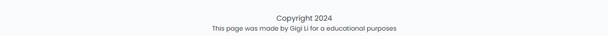
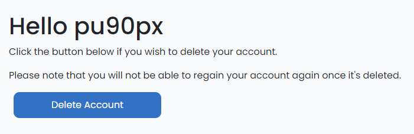

# PU90PX | PHOTOGRAPHER

Welcome to PU90PX, a website with photos taken by the photographer Pontus Unosson.
I've built this album-website for him to share his work with others. 

Using a combination of HTML, CSS, JavaScript, Python and Django frameworks to create this project, it offers a responsive experience across all devices. The content is easy to navigate and the design has a scandinavian clean touch to it. 

As a visitor to the site, you will find different albums sorted in themes. From nature to animals to city and cars. The visitor is able to interact by commenting on the posts. This is free of charge and the user only has to register for an account. 

Link to the repository on Github: (https://github.com/GigiLi89/pu90px)

Link to the deployed site: (https://pu90px-bb0793838f63.herokuapp.com/)

---

## User Experience (UX)

### User Stories

PU90PX is a page for photographer Pontus Unosson to share his work. A digital gallery where he shares photos of objects he likes to photograph and uploads a photo per category each month. 

He likes to photograph these objects: Nature, Animals, City Cars, Airplanes and Animals. This site is dedicated to his passion for photography and to share it with other with similar interests. 

#### Client Goals

- Easily navigating through the categories to see the photo of the month. 
- Easily navigating through site no matter what device user is on.
- Enable users to comment on individual photos/posts.
- Users are able to create profile to comment.
- Users are also able to delete their own accounts if they wish to do so. 

#### First Time Visitor Goals

- Wants to find photo inspiration
- Wants to be part of a community where you can comment and see other comments. 
- Wants to learn more about photographing

#### Returning Visitors Goals

- Wants to be able to create/login to account/profile to comment. 
- Want to look at what other people have commented.
- Wants to edit or delete previous comments.
- Wants to see if there is any new photos uploaded.

#### Frequent Visitor Goals

- Wants to see if there is any new photos uploaded.
- Wants to see the comments.
- Wants to edit or delete previous comments. 

### Agile Methodology

Before I started on the project I consulted the client (The photographer) what he wished to have on the site. I then created a board of user stories to section up and determine what was needed to be done using Mosow method. 

The User Story Board can be vied [here.](https://github.com/users/GigiLi89/projects/5)

---

## Design

The colours choosen for the site is very clean, Scandinavian clean. 

I used Google Fonts and chose Poppins with Sans-Serif as default. The font is:
(https://fonts.googleapis.com/css2?family=Poppins:ital,wght@0,100;0,200;0,300;0,400;0,500;0,600;0,700;0,800;0,900;1,100;1,200;1,300;1,400;1,500;1,600;1,700;1,800;1,900&display=swap)

### Images

All images on the site are the photographers own photos except the static photo in the placeholder in each post. 
That photo is from pexels. The logo is made by me in Canva. 

### Wireframes

I used Balsamiq to create the Wireframes, please note that on the desktop wireframe the menu is a drop down menu and therefore I added "another menu" under it to simulate it:

A variety of data models were used, please find the chart below:

### Data Models

#### Relationships
- Categories, ManyToMany: The posts can belong to many categories and each Category can have multiple posts. 
- User, One to One: Each user has their own profile that ensures each user to a single profile. 

### Security

- Using env.py to store sensitive information was made and vital to keep the site safe. We can find API keys and database stored in the env.py and it is not included in the version control to prevent exposure.
- I used @login required and  which will help keep unauthorised actions to the site to be made. This ensures for eg. that a user needs to register for an account to be able to comment. 
- Built-in form validation framework that checks for existing users, required fields and password confirmation. Error return if criterias are not fulfilled. 
- Messages/feedback to user. For eg. if user chooses to delete their account a message will pop up with the question to make sure that the user really wants to delete account. 

---

## Features

- The site has an easy structure that is easy to navigate through. At the top of the page we'll find the logo that is also linked to the home page. Depending on device a the menu apperance looks different ("regular menu" or hambuger menu), either way it is a drop down manu for the Accounts where we will find:

If not logged in:
- Register
- Login

If logged in:
- Profile
- Signout

#### Home Page
- Logo at the top left corner, made in Canva by me. Links back to the Home page. 
- Menu either next to logo or hamburger menu in the upper right corner with Home and Account. 
    - Account dropdown menu has the featured listed above. 
- Header: Features a presentation text about the photographer and his work
- Content/pagination: Features the categories/albums with a photo in each card as well as theme, a small description, who posted it and the date it was posted. 
- Footer: Has a copyright text as well as a description of who made it and the purpose of making it. The client did not want to link his social medias on the site therefor I did not use Font Awesome icons or any other links for that. 

Album page:

Header and Footer:

#### Album Pages
- Logo at the top left corner, made in Canva by me. Links back to the Home page. 
- Menu either next to logo or hamburger menu in the upper right corner with Home and Account. 
    - Account dropdown menu has the featured listed above.
- Header with album category description, photographer and an image from pexels. 
- Content: Presentation of the image of the month with information like: location, gear etc. Under the presentation text we'll find the photo of the month. 
- Footer: We'll find a counter for the comments as well as the comments and (if logged in) a textfield to write a comment. If logged in, user can also edit or delete previous posts they've made. 

Register account:

Delete account:

#### User Account Page
- Register page: User can sign up for an account/profile in order to write comments on the posts. 
- Sign in: Allows registered user to sign in and access the feature to comment. 
- Profile page: Has a small information text that user can delete their account if they wish to and that they can't recover the account back if it's deleted. Pressing the delete button will trigger a flash message asking the user if they are sure. If they click yes - The account will be deleted. 
- Sign out: User can click on the sign out button to sign out, asked if they want to sign out and a message afterwards saying they're signed out. 

Sign in page:

Sign out page:

In all stages, status will be shown to the user that they are either signed in (and as what user) or signed out. 

###Future Implementations
- Update user profile with information of the user, possibly what camera gear they are using or photo categories they like. 
- Sort photos in the themed categories and presented in a dropdown menu. 
- A page about the camera gear that the photographer is using. 
- Share presets that the photographer has made in Adobe Lightroom.
- A map feature showing where the photo was taken.
- Contact page to contact photographer directly on the site. 
- Like button or a rating system to rate the photos.

### Accessibility

The Accessability on the site is good, I always make sure to check the contrasts with a very good tool called WEB Aim Contrast Checker: 

## Technologies & Frameworks

### Main technologies
- HTML: Creating the structure
- CSS: Adding the styling
- JavaScript: Adding functionality
- Django: Using Python based framworks for back end development.
- Cloudinary: Cloud based storage to store media files like images and videos. 
- Django ORM (Object-Relational Mapper) to interact with databases

By using Django Admin and Cloudinary together I used an SQL Database to store information of my Django models and attibutes, even though Cloudinary alone is not a SQL database.

### Frameworks and resources
- Am I Responsive?: Showing the responsiveness on different devices.
- Balsamiq: Created the wireframes.
- Gitpod: IDE to deploy workspace enviroment to Github.
- Cloudinary: cloud based storage for media.
- Github: To store all files and create and access projects and issues.
- Google Fonts: to import fonts.
- Google Dev Tools: for troubleshooting and solce issues with styling and images.
- Heroku: hosting and deploying of the site.
- Microsoft Excel: Creating data models.
- Canva: Creating logo and editing images.
- JSHint: To check JavaScript files for bugs.
- Lighthouse: To test accessability.
- W3C Markup Validator: To check HTML files for bugs.
- W#C CSS Validator: To check CSS files for bugs. 

### Deployment

#### Working enviroment
- In your IDE open your env.py file or create one in the main directory if it hasn't been created for you.
- Having created your cloud-based database, add the DATABASE_URL value and a SECRET_KEY value to the env.py file.
- Open the settings.py file and import the env.py file and the DATABASE_URL and SECRETKEY file paths.
- Install Django and add to requirements.txt with pip.
- Create your project with a name of your choice.
- Add the STATIC files settings.
- Create a file called Procfile (Important! with a capital P) in the main directory,
- For cloud-based image storage, add Cloudinary URL to env.py (Importaqnt! Do not add sensitive information in settings.py even if it says so in the instructions)
- Add Cloudinary libraries to INSTALLED APPS.
- Add your IDE workspace and Heroku to ALLOWED_HOSTS.
- Make migrations and migrate.
- Before you add, commit & push your files to GitHub, ensure DEBUG is set to False in your settings.py file.

#### Deploying to Heroku
- Login or create an account on Heroku.com. Click 'New' and then 'Create New App'.
- Give your project a unique name and select a region (if you can't find your region, choose one that is closest to you), then click 'Create App'.
- Connect your Heroku project to your GitHub repository. Under deployment you can choose GitHub, find the relevant one or type in the repository name and click 'Connect.
- Once connected, go to the Settings tab and click on 'Reveal Config Vars'. Add the environment key & value variables used above in your env.py file (CLOUDINARY_URL, DATABASE_URL & SECRET_KEY).
- Next add DISABLE_COLLECTSTATIC and add 1 if this is to be disabled to prevent errors, or 0 if the app is in a state where errors will not be generated.
- Click on Buildpack further down and click Add Buildpack to confirm Heroku buildpack is present.
- Navigate to the Deploy section, click on Github for the deployment method and confirm.
- Search for your repository name and click connect.
- At the bottom of the deploy section, make sure you are connected to the main branch and then click Deploy Branch (manually is prefered).
- When deployed, go to the top of the page and click on the Open App button. 
- Your app is now deployed to Heroku and ready to be viewed.

### Local development

#### Forking repository
To fork a repository on Github:

1. Log in to Github - or regiter for a new account if you don't have an account.
2. Click on the chosen repository name.
3. Click the Fork button at the top of the page on the right hand side.

#### Clone repository

To clone a repository on Github:

1. Log in to Github - or regiter for a new account if you don't have an account.
2. Find or create your own repository.
3. Click on the code button, select either clone with HTTPS, SSH or GitHub CLI and copy the link shown.
4. Open the terminal in your code editor (IDE) and change the current working directory to the location you want to use for the cloned directory.
5. Inte the terminal, type: 'git clone' and paste the link you copied in step 3. Press enter.

---

## Testing

I continually rested the site throughout the building process and fixed any issues as I went along with it. 

Please find the testing documentation in a seperate file, link below:

[TESTING.md](TESTING.md)

---

## Credits & Resources
- Code Institute, especially the Django Walkthrough Project. Amazingly done!
- Django secret key generator: https://djecrety.ir/
- Webp converter: https://convertio.co/png-webp/
- Royalty free photos: https://www.pexels.com/sv-se/sok/gratis%20bilder/
- Making the alert message pop: https://sweetalert2.github.io/#icons
- Color palette: https://coolors.co/
- Bootstrap: https://getbootstrap.com/
- Learn Django: https://learndjango.com/
- Youtube tutorials: https://www.youtube.com/watch?v=ygzGr51dbsY
    - https://www.youtube.com/watch?v=Rp5vd34d-z4
    - https://www.youtube.com/watch?v=nGIg40xs9e4
- Contrast checker: https://webaim.org/resources/contrastchecker/
- Pep8: https://pep8ci.herokuapp.com/

### Acknowledgements
- A big big thanks to Rebecca and John at the Tutor support.
- To my friends and family who is always there for support and help if I need someone to test the site.
