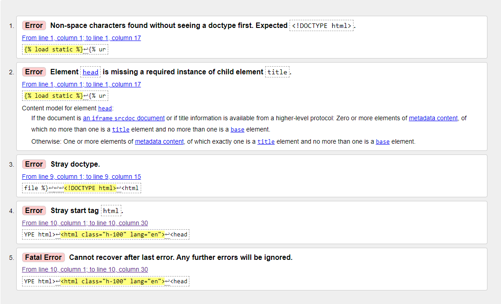
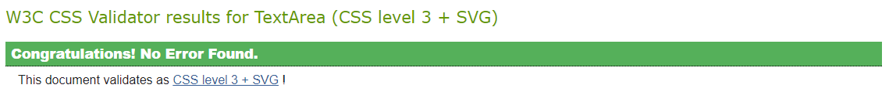
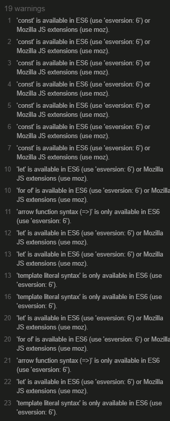
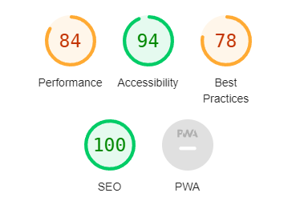
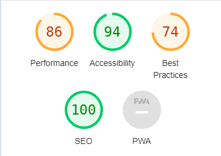
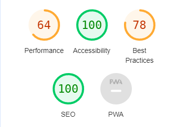
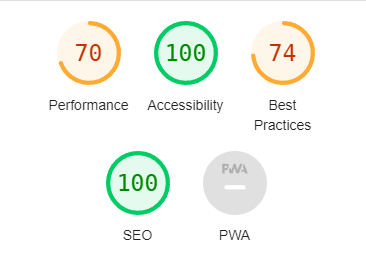

# PU90PX - TESTING

[View the live site here](https://pu90px-bb0793838f63.herokuapp.com/)

I carried out test along the process of building the website. Getting the images to work was the biggest struggle for me and I'm greatful for the tutor team helping me and teaching me more about it. As for the design in comparison to the Wireframes I made before starting building the project it is quite similar. 

I've mostly used Chromes Developer Tool to solve bugs and also going back and forth between my workspace and deploying to Heroku to make sure that the deployed version works as well as the local one. 

## Tests & results

### W3C HTML Validator
I used the W3C HTML Validator to validate the HTML code. 

#### base.html:

Apart from the errors occuring due to the implemented Django Template Language. Other than that, there was no error occuring.

#### index.html:

The same was for index.html but a couple of more errors, which is expected, since we are inheriting the base from base.html. Other than that it is the same as the base.html showing the errors since we're using Django. 

#### post_detail.html:

- Apart from the same error as mentioned above the validator found:
    - A space in the script source, bug was fixed by removing that extra space. 
    - comment_id attribute in the button tag was throwing an error. Fixing this bug could be to change the comment_id to data-comment-id would solve that issue but will throw other errors since we're using different languages in this project. The function works as it should and therefor I will highlight this error and leave it as it is. 

### W3C CSS Validator
I used the W3C CSS Validator to validate the HTML code. 

No errors occured in for the CSS - woho!

### JSHint Validator
I used JSHint Validator to validate the JavaScript files.

All errors from JSHint indicating ES6 errors which will be ignored after consulting my mentor and tutor. 

#### PEP8 CI Python Linter

I used Code Institutes PEP8 Python Linter to help me find the errors. Nothing major, just missing a blank line here and there and that is fixed. 

### Google Chrome Dev Tools

Was throwing console errors about third party cookie, this is caused because of the content upload via Django admin. I've added a sessions_cookie_name to None in the settings.py. I have commented the code out for now since login to admin panel doesn't work if it's on but I have still stored it in the settings.py file. 

#### Lighthouse

Lighthouse also indicated on the Performance which was at a low 32. I changed all the images to webp from jpg/png which got it up to 46. I then compressed the images using Djangos Pillow which got it up to 76. After editing the images and resizing them I got the Performance up to 84. What's mostly affecting the score is the images but since it is a digital gallery, the images is the focus of the site.

Lighthouse Desktop Home Page Score: 

Lighthouse Mobile Home Page Score:

Lighthouse Desktop Content Page Score:

Lighthouse Mobile Content Page Score:

What's affecting the Best Practise score is mostly the third party cookies due to using Django Admin Panel to upload content and also Cloudinary is causing some issues that lowers the score.

---

### Manual Testing

| Category                    | Features                                        | Expected Outcome                                                                                                                                                        | Testing Performed                                             | Pass/Fail |
| --------------------------- | ----------------------------------------------- | ----------------------------------------------------------------------------------------------------------------------------------------------------------------------- | ------------------------------------------------------------- | --------- |
| Navbar                      | Logo with link                                  | The logo appearing in the upper left corner should direct to the Home Page, regardless of which page it's from                                                          | Clicked on logo                                               | Pass      |
|                             | Menu (Home) Device mode                         | The Home button in the menu should direct to the Home Page, regardless og which page it's from.                                                                         | Clicked on Home Button                                        | Pass      |
|                             | Menu (Account) Device mode                      | Account drop down menu should show two buttons when logged out. Register and sign in.                                                                                   | Clicked on Account Button                                     | Pass      |
|                             | Menu - Account - Register                       | When clicking on the Register button inside the drop down menu it should redirect to register site                                                                      | Clicked on Register Button                                    | Pass      |
|                             | Menu - Account - Sign In                        | When clicking on the Sign in button inside the drop down menu it should redirect to the sign in page                                                                    | Clicked on the Sign In Button                                 | Pass      |
|                             | Menu Tablet/mobile device                       | Hamburger menu should appear insted of "regular menu" like on desktop, when clicked an option of Home and Account should appear                                         | Clicked on Hamburger menu                                     | Pass      |
|                             | Menu Tablet/mobile device (Home)                | In hamburger menu, when clicking the Home button it should direct to Home Page                                                                                          | Clicked Home button                                           | Pass      |
|                             | Menu Tablet/mobile device (Account, signed out) | In hamburger menu, when clicking the Account button a dropdown menu with register and signin should appear if logged out                                                | Clicked Account Button                                        | Pass      |
|                             | Menu Tablet/mobile device (Account, signed in)  | In hamburger menu, when clicking on the Account button a dropdown menu with Profile and sign out should appear if logged in                                             | Clicked Account Button                                        | Pass      |
|                             | Menu/Account/Register                           | When clicking on the register button it should direct to register page                                                                                                  | Clicked on Register Button                                    | Pass      |
|                             | Menu/Account/Login                              | When clicking on the login button it should direct to the sign in page                                                                                                  | Clicked on the Login Button                                   | Pass      |
|                             | Menu/Account/Profile                            | When clicked on the profile button it should direct to the profile page                                                                                                 | Clicked on the Profile Button                                 | Pass      |
|                             | Menu/Account/Signout                            | When clicked on the signout button it should direct to the signout page                                                                                                 | Clicked on the Sign Out Button                                | Pass      |
| Register/Sign In / Sign Out | Register (Sign up) Sucessful                    | When adding all the information required and pressing Sign up it should direct to Home page as a logged in user                                                         | Filled out necessary fields and clicked Sing Up Button        | Pass      |
|                             | Register (Sign up) Unsucessful                  | When all required fields are not filled in an error is triggered asking user to fill out the missing fields                                                             | Did not fill out username and clicked Sign Up Button          | Pass      |
|                             | Sign in Successful                              | When username and password is filled in successfully and sign in is clicked it should direct to home page as a logged in user                                           | Filled in username and password and clicked Sign In Button    | Pass      |
|                             | Sign in message                                 | When user have signed in a message at the top of the page will show informing guest they are now logged in.                                                             | Clicked Sign In Button                                        | Pass      |
|                             | Sign in Unsucessful                             | When user filled in wrong username and password or missed any required field an error is thrown asking user to fill it in.                                              | Missed and typed in wrong username and clicked Sign In Button | Pass      |
|                             | Profile/Delete Account                          | When clicking on delete button a pop up message is shown asking user if they are sure they want to delete account                                                       | Clicked Delete Button                                         | Pass      |
|                             | Delete Button - Yes                             | When user clicks yes on question if they are sure they want to delete account it should direct to page informing user the account is deleted and the account is deleted | Clicked Yes Button                                            | Pass      |
|                             | Delete Button - No                              | When user clicks no on question if they are sure they want to delete account pop up message should close and user will be back on the profile page                      | Clicked No Button                                             | Pass      |
|                             | Logout                                          | When logout button is clicked it should direct to page asking user if they are sure they want to sign out                                                               | Clicked on Logout Button                                      | Pass      |
|                             | Signout                                         | On sign out page user can click on sign out button and  it should redirect to home page as a guest (not logged in)                                                      | Clicked on Signout Button                                     | Pass      |
|                             | Signout message                                 | When signed out user will se a message at the top of the site informing user that they have been signed out                                                             | Clicked on Signout Button                                     | Pass      |
| Albums (Posts)              | Posts                                           | When user clicks on any of the posts (albums) it should direct to that specific themed photo post.                                                                      | Clicked on the posts                                          | Pass      |
|                             | Inside post                                     | User should be able to see the post (a photo and information about the photo)                                                                                           | Clicked post and got directed to post (album)                 | Pass      |
| Comments                    | Leave comment                                   | Logged in user can post comments at the bottom of the page in a post by writing in the text field and clicking submit                                                   | Wrote a test and clicked Submit Button                        | Pass      |
|                             | Approve comment                                 | When user has left a comment, admin is able to chose to approve the comment first.                                                                                      | Logged in as admin and checked admin panel, approved comment  | Pass      |